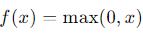

# Key Operations in Convolutional Neural Networks (CNNs)

Convolutional Neural Networks (CNNs) utilize several key operations that are fundamental to their architecture and functionality in processing visual data like images. Here are the key operations:

#### 1. Convolution Operation

- **Purpose**: Applies a convolutional filter (kernel) to input data to extract features such as edges, textures, and patterns.
- **Process**: 
  - Slides the kernel over the input image in small steps (determined by stride).
  - Computes dot products between the kernel and the overlapping input patch.
  - Produces a feature map that highlights important features detected by the kernel.
- **Parameters**: Includes kernel size, stride, and padding (to preserve spatial dimensions).

#### 2. Activation Functions

- **Purpose**: Introduces non-linearity into the network, allowing it to learn complex relationships and patterns in data.
- **Common Activation Functions**:
  - **ReLU (Rectified Linear Unit)**:  Most widely used due to its simplicity and effectiveness in overcoming vanishing gradient problem.
  - **Sigmoid**:   Squeezes output values between 0 and 1, used in binary classification tasks.
  - **TanH (Hyperbolic Tangent)**:   Similar to sigmoid but outputs values between -1 and 1, sometimes used in hidden layers.

#### 3. Pooling (Downsampling)

- **Purpose**: Reduces the spatial dimensions of the feature map, reducing computation and controlling overfitting.
- **Types of Pooling**:
  - **Max Pooling**: Extracts the maximum value from each patch of the feature map.
  - **Average Pooling**: Computes the average value from each patch.
- **Parameters**: Pool size (e.g., 2x2), stride (step size for sliding the pooling window).

#### 4. Fully Connected Layers

- **Purpose**: Traditional neural network layers that connect every neuron in one layer to every neuron in the next layer.
- **Location**: Typically found at the end of the CNN architecture, taking flattened feature vectors as input.
- **Usage**: Performs classification (softmax activation for multi-class) or regression tasks based on extracted features.

#### Operations Integration

- **Flow**: CNNs typically start with convolutional layers to extract features, followed by activation functions to introduce non-linearity, pooling layers to downsample feature maps, and end with fully connected layers for classification or regression tasks.
- **Learning**: These operations collectively enable CNNs to learn hierarchical representations of data, capturing spatial hierarchies of features essential for tasks like image classification, object detection, and segmentation.
