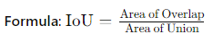

# Evaluation Metrics for Image Classification, Segmentation, and Detection

#### 1. Image Classification

**Accuracy**:
- **Definition**: The ratio of correctly predicted instances to the total instances.
  
  
**Precision**:
- **Definition**: The ratio of correctly predicted positive observations to the total predicted positives.
  

**Recall (Sensitivity)**:
- **Definition**: The ratio of correctly predicted positive observations to all observations in the actual class.
   

**F1-Score**:
- **Definition**: The harmonic mean of precision and recall.
   

**Confusion Matrix**:
- **Definition**: A table used to describe the performance of a classification model by comparing actual versus predicted values.
- **Structure**:
  - Rows represent actual classes.
  - Columns represent predicted classes.

**ROC Curve and AUC**:
- **ROC Curve (Receiver Operating Characteristic)**: Graph showing the true positive rate (TPR) against the false positive rate (FPR) at various threshold settings.
- **AUC (Area Under the Curve)**: The area under the ROC curve, representing the model's ability to discriminate between positive and negative classes.

#### 2. Image Segmentation

**Intersection over Union (IoU)**:
- **Definition**: The ratio of the intersection of the predicted segmentation and the ground truth to their union.
 

**Pixel Accuracy**:
- **Definition**: The ratio of correctly classified pixels to the total number of pixels.
 

**Mean Pixel Accuracy (mPA)**:
- **Definition**: The average pixel accuracy for each class.
 

**Dice Coefficient (F1 Score for Segmentation)**:
- **Definition**: Measures the similarity between two samples.
 

**Mean Intersection over Union (mIoU)**:
- **Definition**: The mean IoU across all classes.
 

#### 3. Object Detection

**Precision and Recall**:
- **Precision**: Ratio of correctly detected objects to the total number of detected objects.
- **Recall**: Ratio of correctly detected objects to the total number of actual objects.

**Average Precision (AP)**:
- **Definition**: The average of precision values at different recall thresholds.
 

**Mean Average Precision (mAP)**:
- **Definition**: The mean of Average Precision (AP) values for all classes.
 

**Intersection over Union (IoU)**:
- **Definition**: Used to evaluate the overlap between the predicted bounding box and the ground truth bounding box.
 

**Precision-Recall Curve**:
- **Definition**: A graph showing the trade-off between precision and recall for different threshold values.
- **Use**: Helps to visualize the performance of the detection model across different recall levels.

**Confidence Score**:
- **Definition**: The probability that a predicted bounding box contains an object and the accuracy of the object class prediction.
- **Use**: Thresholding the confidence score helps to filter out low-confidence detections.

### Summary
- **Image Classification**: Use metrics like accuracy, precision, recall, F1-score, confusion matrix, and ROC-AUC.
- **Image Segmentation**: Use metrics like IoU, pixel accuracy, mPA, dice coefficient, and mIoU.
- **Object Detection**: Use metrics like precision, recall, AP, mAP, IoU, precision-recall curve, and confidence score.

