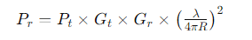
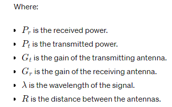

# Communication System Components

## Transmitter Block Diagram

A typical transmitter block diagram consists of the following components:

1. **Information Source**: Provides the message signal to be transmitted.
2. **Transducer**: Converts the message signal into an electrical signal suitable for processing.
3. **Modulator**: Modulates the carrier signal with the message signal to generate the modulated signal.
4. **Transmitter Amplifier**: Amplifies the modulated signal to a suitable power level for transmission.
5. **Antenna**: Transmits the modulated signal over the communication channel.

## Receiver Block Diagram

A typical receiver block diagram consists of the following components:

1. **Antenna**: Receives the modulated signal transmitted by the transmitter.
2. **Receiver Amplifier**: Amplifies the received signal to a level suitable for processing.
3. **Demodulator**: Demodulates the received signal to recover the original message signal.
4. **Transducer**: Converts the electrical signal into a form suitable for the output device.
5. **Output Device**: Presents the recovered message signal to the user.

## Sensitivity & Signal-to-Noise Ratio (SNR)

- **Sensitivity**: Refers to the minimum input signal power required by the receiver to produce a specified output signal-to-noise ratio (SNR).
- **Signal-to-Noise Ratio (SNR)**: Represents the ratio of the signal power to the noise power in the received signal. It indicates the quality of the received signal relative to the noise level.

## Friis Transmission Equation

The Friis Transmission Equation calculates the power received by an antenna from another antenna at a certain distance in free space. It is given by:

The Friis Transmission Equation is fundamental in predicting the received power in wireless communication systems and is used in link budget analysis for system design and optimization.