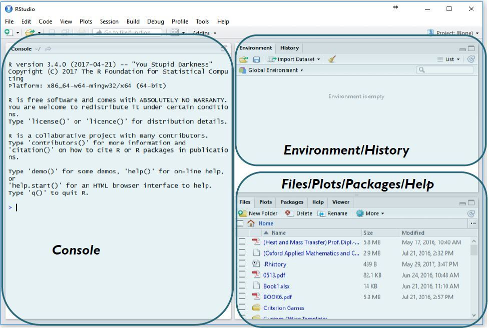

# Getting Started with Statistical Methods Using R

## Introduction to Statistical Methods

- **What is Statistics?**
  - Statistics involves collecting, organizing, analyzing, interpreting, and presenting data.

- **Why Use R?**
  - R is a powerful statistical programming language and software environment for statistical computing and graphics.
  - It offers a wide range of statistical techniques and is open-source, making it accessible to all.

## Installing R and RStudio

- **Downloading R:**
  - Go to the Comprehensive R Archive Network (CRAN) website and download the appropriate version for your operating system.

- **Installing R:**
  - Follow the installation instructions provided for your operating system.

- **Downloading RStudio:**
  - Visit the RStudio website and download the appropriate version for your operating system.

- **Installing RStudio:**
  - Follow the installation instructions provided for your operating system.

## Basic Operations in R

- **Running RStudio:**
  - Open RStudio after installation.

- **RStudio Interface:**
  - Familiarize yourself with the RStudio interface, including the script editor, console, environment, and file browser.

- **Running Commands:**
  - Use the console to run commands directly.
  - Use the script editor to write and save scripts.

## Working with Data in R

- **Importing Data:**
  - Use functions like `read.csv()` or `read.table()` to import data from files.
  - Explore options for reading different types of data formats.

- **Viewing Data:**
  - Use functions like `head()` and `tail()` to view the first or last few rows of your dataset.
  - Understand the structure of your data using functions like `str()`.

## Basic Statistical Analysis in R

- **Descriptive Statistics:**
  - Compute summary statistics such as mean, median, standard deviation, etc., using functions like `summary()` and `mean()`.

- **Data Visualization:**
  - Create plots and charts to visualize data using functions like `plot()` and `ggplot2`.

- **Inferential Statistics:**
  - Perform hypothesis tests and confidence interval estimation using functions like `t.test()` and `confint()`.

## What is R Programming Language?

- R programming is used as a leading tool for machine learning, statistics, and data analysis. Objects, functions, and packages can easily be created by R.
- It’s a platform-independent language. This means it can be applied to all operating systems.
- It’s an open-source free language. That means anyone can install it in any organization without purchasing a license.
- R programming language is not only a statistic package but also allows us to integrate with other languages (C, C++). Thus, you can easily interact with many data sources and statistical packages.
- The R programming language has a vast community of users and it’s growing day by day.
- R is currently one of the most requested programming languages in the Data Science job market which makes it the hottest trend nowadays
- It was designed by Ross Ihaka and Robert Gentleman at the University of Auckland, New Zealand, and is currently being developed by the R Development Core Team.
- R programming language is an implementation of the S programming language. It also combines with lexical scoping semantics inspired by Scheme. Moreover, the project was conceived in 1992, with an initial version released in 1995 and a stable beta version in 2000.

### Why Use R?

- **Open Source**: R is open-source, meaning it's freely available for anyone to use, modify, and distribute. This makes it accessible to a wide range of users and promotes collaboration.

- **Large Community**: R has a large and active community of users, developers, and contributors. This community support provides access to a wealth of resources, including packages, forums, and tutorials.

- **Statistical Analysis**: R is specifically designed for statistical analysis, making it powerful and flexible for data analysis, visualization, and modeling. It offers a wide range of statistical functions and techniques.

- **Rich Ecosystem**: R has a rich ecosystem of packages covering various domains such as machine learning, data manipulation, time series analysis, and more. These packages extend R's functionality and make it suitable for diverse analytical tasks.

- **Data Visualization**: R provides extensive capabilities for data visualization, allowing users to create a wide range of plots, charts, and graphs to explore and communicate their data effectively.

- **Reproducibility**: R promotes reproducible research by allowing users to document their analyses in a structured and transparent manner using R Markdown, which integrates code, output, and narrative text into a single document.

- **Integration**: R seamlessly integrates with other programming languages and tools, making it easy to incorporate R code into larger workflows or systems. It also supports interoperability with databases, spreadsheets, and other data sources.

- **Cross-Platform**: R is cross-platform, meaning it can run on various operating systems such as Windows, macOS, and Linux, providing flexibility and compatibility across different environments.

- **Education and Training**: R is widely used in academia and industry for teaching and training in statistics, data science, and related fields. Its popularity in educational settings ensures a steady supply of skilled R users in the workforce.

### Features of R Programming Language

- R Packages: One of the major features of R is it has a wide availability of libraries. R has CRAN(Comprehensive R Archive Network), which is a repository holding more than 10, 0000 packages.

- Distributed Computing: Distributed computing is a model in which components of a software system are shared among multiple computers to improve efficiency and performance. Two new packages ddR and multidplyr used for distributed programming in R were released in November 2015.

### Statistical Features of R

- Basic Statistics: The most common basic statistics terms are the mean, mode, and median. These are all known as “Measures of Central Tendency.” So using the R language we can measure central tendency very easily.

- Static graphics: R is rich with facilities for creating and developing interesting static graphics. R contains functionality for many plot types including graphic maps, mosaic plots, biplots, and the list goes on.

- Probability distributions: Probability distributions play a vital role in statistics and by using R we can easily handle various types of probability distributions such as Binomial Distribution, Normal Distribution, Chi-squared Distribution, and many more.

- Data analysis: It provides a large, coherent, and integrated collection of tools for data analysis.

## Introduction to R Studio

R Studio is an integrated development environment(IDE) for R. IDE is a GUI, where you can write your quotes, see the results and also see the variables that are generated during the course of programming. 

- R Studio is available as both Open source and Commercial software.
- R Studio is also available as both Desktop and Server versions.
- R Studio is also available for various platforms such as Windows, Linux, and macOS.

### Introduction to R studio for beginners:

Rstudio is an open-source tool that provides Ide to use R language, and enterprise-ready professional software for data science teams to develop share the work with their team.

- The **console panel(left panel)** is the place where R is waiting for you to tell it what to do, and see the results that are generated when you type in the commands.
- To the top right, you have the **Environmental/History panel**. It contains 2 tabs: 
- **Environment tab:** It shows the variables that are generated during the course of programming in a workspace that is temporary.
- **History tab:** In this tab, you’ll see all the commands that are used till now from the start of usage of R Studio.
- To the right bottom, you have another panel, which contains multiple tabs, such as files, 
plots, packages, help, and viewer. 
- The **Files tab** shows the files and directories that are available within the default workspace of R.
- The **Plots tab** shows the plots that are generated during the course of programming.
- The **Packages tab** helps you to look at what are the packages that are already installed in the R Studio and it also gives a user interface to install new packages.
- The **Help tab** is the most important one where you can get help from the R Documentation on the functions that are in built-in R.
- The final and last tab is that the **Viewer tab** which can be used to see the local web content that’s generated using R.

## Conclusion

Getting started with statistical methods using R involves installing R and RStudio, familiarizing yourself with the RStudio interface, working with data, performing basic statistical analysis, and visualizing results. R provides a robust platform for conducting statistical analysis and is widely used in research and industry.

## Details 

### What is R?

R is a programming language and software environment for statistical computing and graphics. It is widely used in various fields, including data mining, bioinformatics, and data analysis, due to its powerful capabilities in statistical computing and data visualization. R is open-source and free software, licensed by the GNU Project under the GNU General Public License.

The core R language is augmented by a large number of extension packages, which contain reusable code, documentation, and sample data. R software is written primarily in C, Fortran, and R itself, and it is available for various operating systems, including arm64 and x86-64. R has a native command line interface and supports multiple third-party graphical user interfaces, such as RStudio and Jupyter.

R was started by professors Ross Ihaka and Robert Gentleman as a programming language to teach introductory statistics at the University of Auckland. The name "R" comes from being both an S language successor and the shared first letter of the authors, Ross and Robert. R became a GNU project in 1997 and released its first official 1.0 version in 2000.

R is known for its steep learning curve, but its benefits far exceed the effort invested, especially when combined with learning or repeating statistics. It is a powerful tool for statistical data processing, including frequentist statistics, Bayesian statistics, meta-analysis, machine and deep learning, parallel computing, and Big Data processing. R is also a social and subcultural phenomenon, with packages made by users themselves and shared through CRAN, the official and unofficial user forums and networks, and The R Foundation, a non-profit organization dedicated to the continued development of R.

In summary, R is a powerful and versatile programming language and software environment for statistical computing and graphics, widely used in various fields and supported by a large community of users and developers. It is open-source, free software, and available for various operating systems. R's steep learning curve is offset by its benefits, making it a valuable tool for statistical data processing and analysis.

### What are the key features of R programming language?

R is a programming language and software environment for statistical computing and graphics. It is widely used in various fields, including data mining, bioinformatics, and data analysis, due to its powerful capabilities in statistical computing and data visualization. R is open-source and free software, licensed by the GNU Project under the GNU General Public License.

R has several key features that make it a popular choice for data analysis and statistical computing:

1. **Programming language**: R is a well-developed, simple, and effective programming language that includes conditionals, loops, user-defined recursive functions, and input and output facilities.
2. **Data handling and storage**: R has an effective data handling and storage facility that allows for efficient data manipulation and analysis.
3. **Operators**: R provides a suite of operators for calculations on arrays, lists, vectors, and matrices.
4. **Data analysis tools**: R provides a large, coherent, and integrated collection of tools for data analysis, including statistical tests, regression analysis, time series analysis, and machine learning algorithms.
5. **Graphics**: R provides graphical facilities for data analysis and display, including static and interactive graphics that can be used for data visualization and reporting.
6. **Packages**: R has a wide availability of libraries, called packages, that extend its functionality and provide pre-assembled collections of functions and objects that make operating R easier and hassle-free.
7. **Cross-platform**: R is suitable for GNU/Linux and Windows operating systems and is cross-platform, meaning it can run on any operating system.
8. **Open-source**: R is open-source software that is accessible to everyone and can be easily integrated with different applications and processes.
9. **Performs complex statistical calculations**: R is widely used by data scientists and business leaders for its ability to perform simple and complex mathematical and statistical calculations.
10. **Compatibility**: R is compatible with computer programs like C, C++, Java, Python, and others, making it easy to integrate R functions into different computer programs.

R is widely used in various industries, including finance, healthcare, and technology, and is supported by a vibrant and talented community of contributors. It is taught in universities and deployed in mission-critical business applications, making it a valuable tool for statistical data processing and analysis.

### Provide examples of real-world applications where R programming language is commonly used?

R programming language is commonly used in various real-world applications, including:

1. **Finance**: R is widely used in the financial industry for downside risk measurement, adjusting risk performance, visualizations, moving averages, autoregression, time-series analysis, credit risk analysis, and portfolio management.
2. **Banking**: R is used in the banking industry for credit risk modeling, mortgage haircut modeling, and other forms of risk analytics.
3. **Healthcare**: R is used in genetics, bioinformatics, drug discovery, epidemiology, and other healthcare fields for data processing, pre-clinical trials, drug-safety data analysis, exploratory data analysis, and genomic data analysis.
4. **Social Media**: R is used in social media for sentiment analysis, social media data mining, customer segmentation, and targeting.
5. **E-Commerce**: R is used in e-commerce for cross-selling products to customers, analyzing data sources, and optimizing production volume.
6. **Manufacturing**: R is used in manufacturing for analyzing customer sentiment, optimizing product in response to changing consumer interests, matching production volume to changing market demand, reducing production costs, and increasing profits.
7. **Government**: R is used by governments for economic modeling, policy analysis, and decision-making.

R is a versatile programming language that is widely used in various industries and fields. It is an open-source programming language that is compatible with various operating systems and has a vast assortment of intermediate tools dedicated to data analysis. R is considered the most popular analytics tool in the world, with a large community of users and developers.

### What industries commonly utilize R programming language for data analysis and statistical modeling?

R programming language is commonly used in various industries for data analysis and statistical modeling. Some of the industries that commonly utilize R include:

1. **E-Commerce**: R is used in e-commerce for analyzing cross-selling products to customers, carrying out A/B testing analysis across product pages, and performing various statistical procedures like linear modeling for predicting product sales.
2. **Manufacturing**: Manufacturing companies like Ford, Modelez, and John Deere use R to analyze customer sentiment, optimize their product according to trending consumer interests, match production volume to varying market demand, and minimize production costs while maximizing profits.
3. **Retail and Environmental Science**: R is used in retail for customer segmentation, market basket analysis, and demand forecasting, enabling retailers to optimize pricing strategies, enhance customer experience, and drive revenue growth. In environmental science, R is employed for climate modeling, ecological analysis, and environmental monitoring, empowering scientists to study complex environmental phenomena, assess environmental risks, and develop sustainable solutions for a greener future.
4. **Marketing and Advertising**: R programming language is extensively utilized for data analysis, customer segmentation, and predictive modeling. Marketers leverage R’s advanced statistical techniques and machine learning algorithms to analyze consumer behavior, identify target audiences, and personalize marketing campaigns effectively.

R is a versatile programming language that provides a wide range of data types, including character, numeric, integer, logical, complex, and factor, which are used to build data structures or objects. R's data types and structures, such as vectors, lists, matrices, and data frames, allow for efficient data manipulation and analysis. R is widely used in various industries due to its powerful capabilities in statistical computing and data visualization, and its compatibility with various operating systems and other computer programs.

