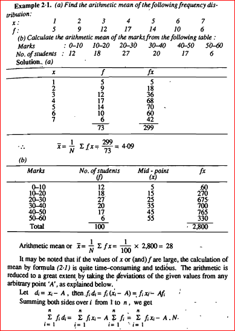

# Arithmetic Mean

## Definition

- The arithmetic mean is a measure of central tendency that represents the average of a dataset.
- It is calculated by summing all values in the dataset and dividing by the total number of values.

## Calculation in R

- In R, the arithmetic mean can be calculated using the `mean()` function.
- This function takes a vector of numeric values as input and returns their arithmetic mean.

## Properties

- The arithmetic mean is sensitive to outliers in the data.
- It is affected by extreme values, which can skew the result.
- The arithmetic mean is widely used in various fields for its simplicity and interpretability.

## Interpretation

- The arithmetic mean provides a single value that summarizes the central tendency of a dataset.
- It is suitable for symmetrically distributed data without significant outliers.
- However, it may not accurately represent the central tendency if the data is skewed or contains outliers.

## Example

```r
# Sample dataset
data <- c(10, 20, 30, 40, 50)

# Calculate the arithmetic mean
mean_value <- mean(data)
print(mean_value)
```

In this example, the arithmetic mean of the dataset `{10, 20, 30, 40, 50}` is calculated to be `30`.

## Details 

The arithmetic mean, also known as the arithmetic average, is a measure of central tendency that calculates the sum of a set of numbers and then divides that sum by the count of the numbers in the set. It is the most commonly used measure of average and is calculated using the formula:

Arithmetic Mean = (Sum of all observations) / (Number of observations)

For example, the arithmetic mean of the numbers 4, 36, 45, 50, and 75 is calculated as (4 + 36 + 45 + 50 + 75) / 5 = 42.

The arithmetic mean is a useful measure of central tendency for interval and ratio level data, and is widely used in statistics and finance. However, it can be influenced by extreme values or outliers, and may not always be the most appropriate measure of central tendency for skewed data. In such cases, other measures of central tendency, such as the median or mode, may be more appropriate.

## Problems 

**1. Find the arithmetic mean of the first 10 prime numbers.**

Solution:

As we know, the first 10 prime numbers are 2, 3, 5, 7, 11, 13, 17, 19, 23, and 29.

Here,

The sum of observations = 2 + 3 + 5 + 7 + 11 + 13 + 17 + 19 + 23 +29 = 129

Number of observations = 10

The arithmetic mean = Sum of observations / Number of observations.

Hence, arithmetic mean = 129/10

Arithmetic mean = 12.9.

--------------------------------------------------------------------------------------------------------------------

**2. Determine the “k” value if the arithmetic mean of 9, 8, 10, k, 12 is 15.**

Solution:

Given that, the mean of 5 numbers is 15.

i.e. (9 + 8 + 10 + k + 12)/5 = 15

Hence, we get

(39 + k)/5 = 15

Now, simplify the above equation, and we get

⇒ 39 + k = 15 × 5

⇒ 39 + k = 75

Now, subtract 39 on both sides, we get

⇒ 39 – 39 + k = 75 – 39

⇒ k = 36

Hence, the value of k is 36.

--------------------------------------------------------------------------------------------------------------------

**3. The mean of 14 numbers is 6. What will be the new mean if 3 is added to every number?**

Solution:

Assume that the given numbers be a1, a2, a3, ….. a14.

Therefore, the mean of these numbers = (a1 + a2 + a3+ ….. a14)/14

Therefore, (a1 + a2 + a3+ ….. a14)/14 = 6

The above equation can be written as:

⇒ a1 + a2 + a3+ ….. a14 = 84 …(1)

To find: New mean if 3 is added to every number.

Therefore, the new numbers are (a1 + 3), (a2 + 3), (a3 + 3), …. ,(a14 + 3)

Mean of the new numbers = (a1 + 3) + (a2 + 3)+(a3 + 3)+ …. +(a14 + 3)/14

The above form can be written as:

Mean of new numbers = [(a1 + a2 + a3+ ….. a14) + 42]/14

Now, use the equation (1), and we get

Mean of new numbers = (84 + 42)/14

Simplifying the values, we get

= 126/14

= 9

Therefore, the new mean obtained is 9.

--------------------------------------------------------------------------------------------------------------------

**4. The arithmetic mean of 40 numbers was found to be 38. It was then discovered that the number 56 had been misinterpreted as 36. Determine the correct mean of the numbers given.**

Solution:

The calculated arithmetic mean of 40 numbers is 38.

Hence, the sum of these numbers = (38 × 40) = 1520.

Thus, the actual sum of these numbers = [1520 – (Incorrect value) + (correct value)]

Correct Mean = 1520 – 36 + 56

Correct Mean = 1540.

Hence, the correct mean of the given numbers = 1540/40 = 38.5.

--------------------------------------------------------------------------------------------------------------------

**5. The arithmetic mean of the first five numbers is 28. The mean is reduced by two when one of the numbers is removed. Find the number that isn’t included.**

Solution:

Given that, the arithmetic mean of 5 numbers = 28.

Thus, the sum of these 5 numbers = (28 x 5) = 140.

Also, given that the mean is reduced by two when one of the numbers is removed.

i.e. The mean of the remaining 4 numbers = (28 – 2) =26.

Therefore, the sum of these remaining 4 numbers = (26 × 4) = 104.

Thus, the number that is not included = (sum of the given 5 numbers) – (sum of the remaining 4 numbers)

= 140 – 104

= 36

Hence, the excluded number is 36.

--------------------------------------------------------------------------------------------------------------------

**6. P and Q have an average monthly salary of Rs. 5050. Q and R have an average monthly income of Rs. 6250, while P and R have an average monthly income of Rs. 5200. Find the monthly salary of P.**

Solution:

Assume that A, B and C represent the monthly income of P, Q, and R, respectively. So, we have

A + B = (5050×2) = 10100….(1)

B + C = (6250×2) = 12500…..(2)

A + C = (5200×2) = 10400….(3)

Now, add the equations 1, 2 and 3:

2(A+B+C) = 33000

The above equation can also be written as:

A + B + C = 33000/2 = 16500…(4)

Now, subtract (2) from (4), we get A = 4000.

Therefore, P’s monthly income is Rs.4000.

--------------------------------------------------------------------------------------------------------------------

**7. For successive three years, a car owner purchases petrol at Rs.7.50, Rs. 8, and Rs. 8.50 a litre. If he spends Rs. 4000 per year on petrol, what is the average cost per litre?**

Solution:

Total amount of petrol consumed over three years = [(4000/7.50)+(4000/8)+4000/8.50)] litres

= 4000[(2/15) +(⅛) + (2/17)] litres

Total = 76700/51 litres

Amount spent in total = Rs. (3 × 4000) = Rs. 12000.

Thus, the average cost = Rs. (12000 × 51) /76700

Hence, the average cost per litre is Rs. 7.98.

--------------------------------------------------------------------------------------------------------------------

**8. A class of 16 boys has an average weight of 50.25 kg, while the remaining 8 boys have an average weight of 45.15 kg. Calculate the average weight of all boys in the class.**

Solution:

16 boys in a class have an average weight of 50.25kg

8 boys in a class have an average weight of 45.15kg

Thus, the required average = [(50.25×16) + (45.15×8)] / (16 + 8)

= ( 804+361.20) / 24

∴ Required average = 1165.20 / 24

= 48.55 kg

Therefore, the average weight of all boys in the class is 48.55 kg.

Also, read: Average.

--------------------------------------------------------------------------------------------------------------------

9. The marks of a student were entered incorrectly as 83 instead of 63. As a result, the class’s average marks increased by half (1/2). Find the number of students in the class.

Solution:

Let’s say the class has x students.

As a result, the overall increase in mark = (x × 1/2) = x/2.

x/2 = 83 – 63

x/2 = 20

x = 40.

Hence, the number of students in the class is 40.

--------------------------------------------------------------------------------------------------------------------

**10. 36 is the arithmetic mean of 25 observations. Find the 13th observation if the mean of the first observation is 32 and the final 13 observations are 39.**

Solution:

The first 13 observations have a mean of 32.

The sum of the first 13 observations is 416, i.e. 32 × 13 = 416.

The average of the last 13 observations is 39.

The sum of the last 13 observations is 507, i.e. 39 × 13 = 507

The average of the 25 observations is 36.

The total of all 25 observations is (36 × 25) = 900.

As a result, the thirteenth observation equals (416 + 507 – 900) = 23.

Therefore, the thirteenth observation is 23.

## More Problems
**Problem 1:**

**The monthly incomes (in dollars) of ten employees in a company are: \$2000, \$2500, \$3000, \$3500, \$4000, \$4500, \$5000, \$5500, \$6000, and \$6500. Find the arithmetic mean, median, and mode of the incomes.**

Solution:
Arithmetic Mean = (2000 + 2500 + 3000 + 3500 + 4000 + 4500 + 5000 + 5500 + 6000 + 6500) / 10
                   = 41500 / 10
                   = \$4150

Median: The median is the middle value when the data is arranged in ascending order. Here, the middle value is the average of the 5th and 6th values.
          Median = (4000 + 4500) / 2
                   = \$4250

Mode: The mode is the most frequently occurring value. In this case, there is no repeated value, so there is no mode.

Comparisons:
The mean income is \$4150, the median income is \$4250, and there is no mode. In this case, the mean and median are close, indicating that the data is symmetrically distributed.

--------------------------------------------------------------------------------------------------------------------

**Problem 2:**

**The weights (in kilograms) of eight students are: 52, 55, 60, 65, 70, 75, 80, and 85. Find the arithmetic mean, median, and mode of the weights.**

Solution:
Arithmetic Mean = (52 + 55 + 60 + 65 + 70 + 75 + 80 + 85) / 8
                   = 542 / 8
                   = 67.75 kg

Median: The median is the middle value when the data is arranged in ascending order. Here, the middle value is the average of the 4th and 5th values.
          Median = (65 + 70) / 2
                   = 67.5 kg

Mode: There is no repeated value, so there is no mode.

Comparisons:
The mean weight is 67.75 kg, the median weight is 67.5 kg, and there is no mode. In this case, the mean and median are very close, indicating that the data is symmetrically distributed.

--------------------------------------------------------------------------------------------------------------------

## Some More Problems


