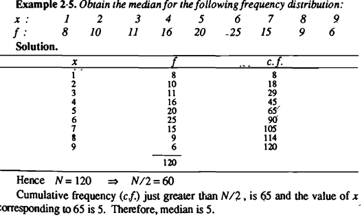
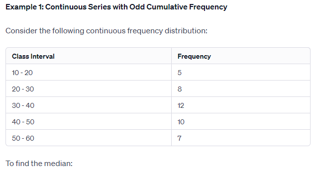
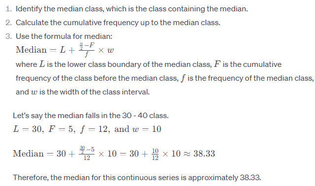

# Median

## Definition

- The median is a measure of central tendency that represents the middle value of a dataset when it is ordered from least to greatest.
- It divides the dataset into two equal parts.

## Calculation in R

- In R, the median can be calculated using the `median()` function.
- This function takes a vector of numeric values as input and returns their median.

## Properties

- The median is robust to outliers in the data, making it suitable for skewed distributions.
- It is not influenced by extreme values as much as the arithmetic mean.

## Interpretation

- The median provides a more accurate representation of central tendency when the data is skewed or contains outliers.
- It is particularly useful when analyzing non-normally distributed data.

## Example

```r
# Sample dataset
data <- c(10, 20, 30, 40, 50)

# Calculate the median
median_value <- median(data)
print(median_value)
```

In this example, the median of the dataset `{10, 20, 30, 40, 50}` is calculated to be `30`.

## Details 

The median is a measure of central tendency that represents the middle value in a dataset when the data is arranged in ascending order. If the dataset has an odd number of observations, the median is the middle value. If the dataset has an even number of observations, the median is the average of the two middle values. The median is a useful measure of central tendency because it is not affected by outliers or skewed data, unlike the mean. It is calculated by first sorting the data from smallest to largest, and then finding the value that separates the higher half from the lower half of the data. The formula for the median depends on whether the number of observations is odd or even. If the number of observations is odd, the formula is:

Median = (n + 1) / 2

where n is the position of the median in the sorted dataset. If the number of observations is even, the formula is:

Median = (n / 2 + (n + 1) / 2) / 2

where n is the position of the first of the two middle values in the sorted dataset. The median is widely used in statistics and data analysis, and is often used in conjunction with other measures of central tendency, such as the mean and mode, to provide a more complete picture of the data.

## Formulas

Median Formulas:
Let us take “n” be the number of observations.

If “n” is odd,

Median = [(n +1)/2]th term

If “n” is even,

Median = [(n/2)th term + ((n/2) + 1)th term]/2

## Problems 

**1. How to find the median?**

Solution:

The steps to find the median are as follows:

Step 1: Arrange the given data in ascending order.

Step 2: Count the number of observations (n) to check whether it is odd or even.

Step 3: If the number of observations (n) is odd, use the formula [(n +1)/2]th term to find the median.

Step 4: If the number of observations (n) is even, use the formula [(n/2)th term + ((n/2) + 1)th term]/2 to find the median value.


**2. The runs scored by 11 players in the cricket match are as follows: 7, 16, 121, 51, 101, 81, 1, 16, 9, 11, 16. Find the median of the data.**

Solution:

Given data: 7, 16, 121, 51, 101, 81, 1, 16, 9, 11, 16.

Now, arrange the data in ascending order, we get

1, 7, 9, 11, 16, 16, 16, 51, 81, 101, 121.

Here, the number of observations is 11, which is odd.

Thus, median = 6th term

Hence, the median of the given data is 16.

**3. Find the median for the data 8, 5, 7, 10, 15, 21.**

Solution:

Arranging the given data in ascending order, we get,

5, 7, 8, 10, 15, 21.

Here, the number of observations is 6, which is even.

Hence, Median = [(n/2)th term + ((n/2) + 1)th term]/2

Median = [(6/2)th term + ((6/2) + 1)th term]/2

Median = (3rd term + 4 term )/2

Here, 3rd term = 8 and 4th term = 10

Therefore, median = (8+10)/2 = 18/2 = 9

Hence, the median of the given data is 9.

**4. What is the relation between mean, median and mode?**

Solution:

The relation between mean, median and mode is (Mean – Median) = 1/3 (Mean – Mode).

This can also be written as follows:

3 (Mean – Median) = (Mean – Mode)

3 Mean – 3 Median = Mean – Mode

3 Median = 3 Mean – Mean + Mode

3 Median = 2 Mean + Mode

Also, read: Relationship between Mean, Median and Mode.

**5. For a moderately skewed distribution, mean = 12 and mode = 6. Using these values, find the value of the median.**

Solution:

Given that, mean = 12 and mode = 6

We know that, 3 Median = 2 Mean + Mode

Now, substitute the values in the formula, we get

3 Median = 2(12) + 6

3 Median = 24 + 6

3 Median = 30

Median = 30/3 = 10.

Hence, the value of median is 10.

**6. What is the median of two numbers?**

Solution:

For a set of two numbers, the value of the median will be the same as the value of the mean.

For example, 2 and 10 are the two numbers.

Here, median = (2+10)/2 = 12/2 = 6

Also, mean = (2+10)/2 = 12/2 = 6.

Hence, the median of two numbers is equal to the mean.

**7. Find the median of the first 5 whole numbers.**

Solution:

The first 5 whole numbers are 0, 1, 2, 3, 4.

Here, the number of observations is 5. So, the 3rd term is the middle term, which is 2.

Hence, the median of the first 5 whole numbers is 2.

**8. What is the median of 4, 2, 7, 3, 10, 9, 13?**

Solution:

Given data: 4, 2, 7, 3, 10, 9, 13

First, arrange the given data in ascending order.

I.e., 2, 3, 4, 7, 9, 10, 13

So, the number of observations is 7. (n= 7)

Since the number of observations is odd, the median can be calculated as follows:

Median = [(n +1)/2]th term

Median = [(7 +1)/2]th term

Median = [(8)/2]th term

Median = 4th term = 7

Hence, the median of 4, 2, 7, 3, 10, 9, 13 is 7.

**9. The marks scored by a student in different subjects are 45, 91, 62, 71, 55. Find the median of the given data using the median formula.**

Solution:

Given data: 45, 91, 62, 71, 55

Arranging the given set in ascending order, we get 45, 55, 62, 71, 91.

Here, we have an odd number of observations. (i.e.) 5.

If “n” is odd, the median formula is [(n +1)/2]th term

= [(5 +1)/2]th term

=[(6)/2]th term = 3rd term = 62.

Hence, the median of the given data is 62.

**10. The weight of 8 students in kgs are 54, 49, 51, 58, 61, 52, 54, 60. Find the median weight.**

Solution:

Given data: 54, 49, 51, 58, 61, 52, 54, 60.

Arranging the data in ascending order, we get 49, 51, 52, 54, 54, 58, 60, 61.

Here, n = 8.

Therefore, the middle two terms are 54 and 54.

Hence, median = (54 + 54)/2 = 108/2 = 54.

Therefore, the median weight is 54 kg.

## Some More Problems

**Calculation: To find the median:**

**For Odd Number of Observations:**

Arrange the data in ascending order.
The median is the middle value.
Example: Consider the dataset: 3, 1, 7, 5, 9 Arranged in ascending order: 1, 3, 5, 7, 9 Median = 5

**For Even Number of Observations:**

Arrange the data in ascending order.
The median is the average of the two middle values.
Example: Dataset: 2, 8, 4, 6 Arranged in ascending order: 2, 4, 6, 8 Median = (4 + 6) / 2 = 5

**Properties:**

The median is unaffected by extreme values (outliers).
It is a suitable measure for skewed distributions.
In a perfectly symmetrical distribution, the mean and median are the same.


**Problem 1:**


**Problem 2:**


