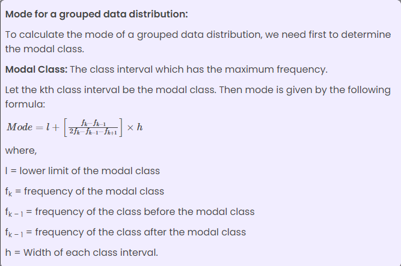
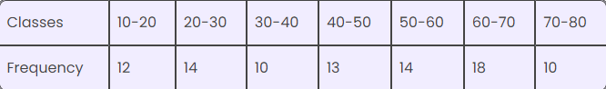
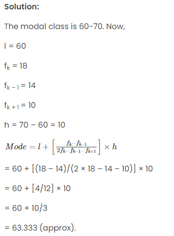
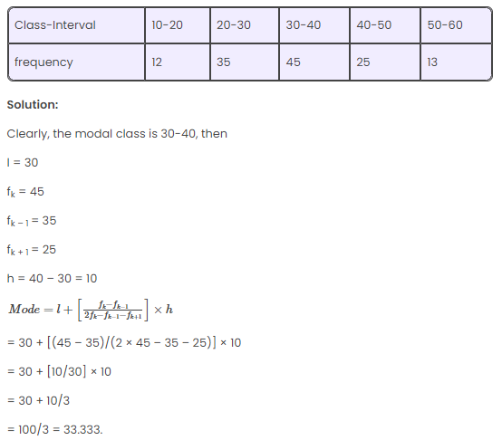
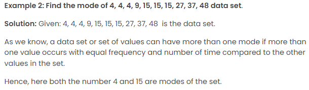
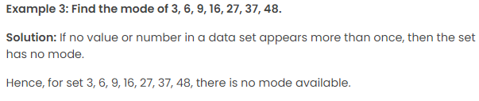
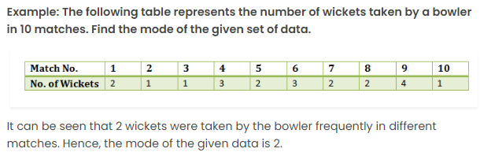
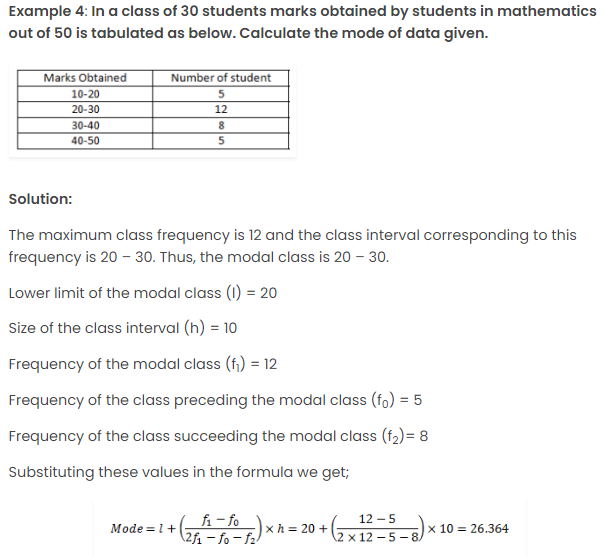

# Mode

## Definition

- The mode is a measure of central tendency that represents the value that occurs most frequently in a dataset.
- A dataset may have one mode (unimodal), two modes (bimodal), or more modes (multimodal).

## Calculation in R

- There is no built-in function for calculating the mode in base R.
- However, you can create custom functions or use packages like `dplyr` to find the mode.

## Properties

- The mode is useful for identifying the most common value or category in a dataset.
- It is particularly applicable to categorical or nominal data.

## Interpretation

- Unlike the mean and median, the mode does not require numerical values and can be applied to any type of data.
- It is especially useful for understanding the distribution of categorical variables.

## Example

```r
# Sample dataset
data <- c(10, 20, 20, 30, 40, 40, 40, 50)

# Function to calculate mode
calculate_mode <- function(x) {
  unique_values <- unique(x)
  frequencies <- tabulate(match(x, unique_values))
  mode_index <- which.max(frequencies)
  mode <- unique_values[mode_index]
  return(mode)
}

# Calculate the mode
mode_value <- calculate_mode(data)
print(mode_value)
```

In this example, the mode of the dataset `{10, 20, 20, 30, 40, 40, 40, 50}` is calculated to be `40`.

## Details 

The mode is a measure of central tendency that represents the most frequently occurring value in a dataset. It is calculated by counting the number of times each value appears in the dataset and identifying the value with the highest count. If there are multiple values with the same highest count, then there is more than one mode. The mode is a useful measure of central tendency for both numerical and categorical data, and it is particularly useful for nominal data, where the concept of mean or median does not apply. In a normal distribution, the mean, median, and mode all coincide, but in skewed distributions, the mode can be different from the mean and median. The mode is not affected by outliers, making it a robust measure of central tendency.

- Most occurring data of the given dataset is called the mode or modal value of the dataset.
- A dataset can have multiple modes; based on this, types of datasets are bimodal, trimodal and multimodal.
- Mode = 3 Median – 2 Mean
- If every data in a given dataset occurs just once, then the dataset has no modal value.
- The modal value is not affected by the highest or lowest value in the dataset.

- Types of the dataset according to multiple modes:

Bimodal – two modal values for the given dataset
Trimodal – three modal values for the given dataset
Multimodal – more than three modal values for the given dataset.

## Mode Questions with Solutions

**Question 1:**

If the ratio of the mode to the median is 2 : 3 for a dataset. Find the ratio of mode to mean.

Solution:

The empirical relationship between mean mode and median is

Mode = 3 Median – 2 Mean.

Let the modal value be 2x, and the median be 3x, then

2x = 3.3x – 2 Mean

⇒ 2 Mean = 9x – 2x

⇒ Mean = 7x/2

∴ Mode : Mean = 2x/(7x/2) = 4/7 = 4 : 7.

--------------------------------------------------------------------------------------------------------------------

**Question 2:**

Find the mode of the following data:

| Value of x | Frequency |
|------------|-----------|
|      5     |     3     |
|     10     |     6     |
|     15     |    10     |
|     20     |     6     |
|     25     |    10     |
|     30     |     5     |
|     35     |     9     |

Solution:

From the given frequency distribution table there are two modes, 15 and 25. Hence, the dataset is bimodal.

--------------------------------------------------------------------------------------------------------------------

**Question 3:**

For any given data, the mean is 45.5, and the median is 43. Find the modal value.

Solution:

We know that,

Mode = 3 Median – 2 Mean

∴ Mode = 3 × 43 – 2 × 45.5

= 129 – 91 = 38.

Mode = 38.

--------------------------------------------------------------------------------------------------------------------



-------------------------------------------------------------------------------------------------------------------

**Question 4:**

Find the mode of the following data distribution:




--------------------------------------------------------------------------------------------------------------------

**Question 5:**

Find the mode of the following data distribution:



## Some More Problems

**Types of Mode:**

- Unimodal: A dataset with one mode.
- Bimodal: A dataset with two modes.
- Multimodal: A dataset with more than two modes.
- No Mode: A dataset with no clear mode (all values occur with the same frequency).

**Properties:**

The mode is not affected by extreme values or outliers.
A dataset can have zero, one, or multiple modes.
In a perfectly symmetrical distribution, the mean, median, and mode are all equal.
Calculation: To find the mode:

**For Raw Data:**

Identify the value(s) that appear most frequently.
Example: Dataset: 4, 2, 6, 4, 8, 4, 7 Mode = 4 (as it appears most frequently).

**For Grouped Data:**

Identify the modal class, which is the class interval with the highest frequency.
Example: Class Interval: 10 - 20, 20 - 30, 30 - 40 Frequencies: 5, 8, 12 Modal class = 30 - 40 (as it has the highest frequency).

**Examples:**
**Example 1: Mode for Raw Data**

Consider the dataset: 3, 5, 2, 7, 3, 8, 3, 2, 6, 5

To find the mode:

Identify the value(s) that appear most frequently.
In this case, the number 3 occurs most frequently (three times).



--------------------------------------------------------------------------------------------------------------------



--------------------------------------------------------------------------------------------------------------------



--------------------------------------------------------------------------------------------------------------------

