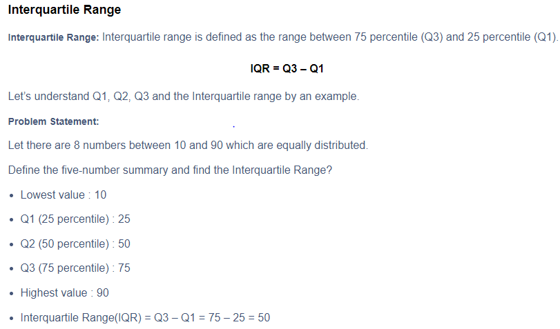
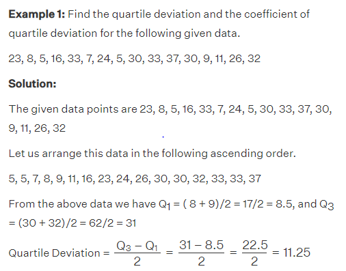
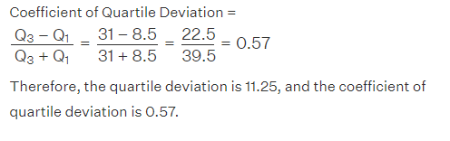
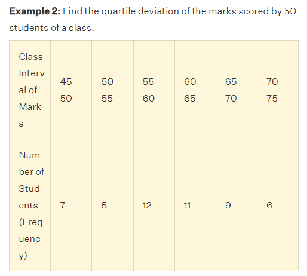
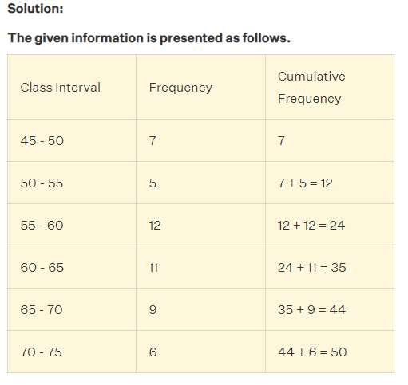
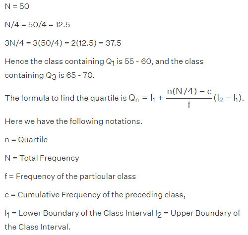
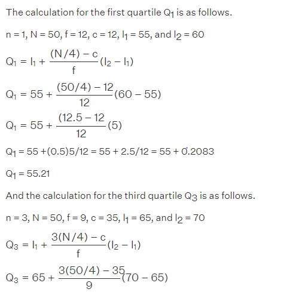
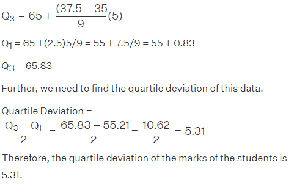

# Measures of Dispersion: Range, Quartile Deviation, Standard Deviation, Variance

## Range

- **Definition:**
  - The range is the difference between the maximum and minimum values in a dataset.
  - It provides a simple measure of the spread of data.

- **Calculation in R:**
  - Use the `range()` function to calculate the range in R.

### How is the range calculated for a given set of data?

The range is a measure of dispersion that represents the difference between the largest and smallest values in a dataset. To calculate the range, follow these steps:

1. Order the values in the dataset from smallest to largest.
2. Identify the smallest value, which is the minimum value in the dataset.
3. Identify the largest value, which is the maximum value in the dataset.
4. Subtract the minimum value from the maximum value to obtain the range.

For example, consider the following dataset: 5, 7, 9, 11, 13. To calculate the range, first order the values from smallest to largest: 5, 7, 9, 11, 13. Then, identify the minimum value as 5 and the maximum value as 13. Finally, subtract the minimum value from the maximum value to obtain the range: 13 - 5 = 8. Therefore, the range of the dataset is 8.

It is important to note that the range is sensitive to outliers, meaning that extreme values can significantly affect the range. Therefore, the range may not always be a reliable measure of dispersion for skewed or heavily tailed distributions.

### What are the different methods for calculating the range of a dataset?

The range is a measure of dispersion that represents the difference between the maximum and minimum values in a dataset. To calculate the range, you can follow these steps:

1. Identify the minimum value in the dataset.
2. Identify the maximum value in the dataset.
3. Subtract the minimum value from the maximum value to obtain the range.

For example, if the minimum value is 10 and the maximum value is 50, the range would be calculated as:

Range = 50 - 10 = 40

Therefore, the range of the dataset is 40.

## Quartile Deviation

- **Definition:**
  - Quartile deviation measures the spread of data by dividing the data into quartiles.
  - It is the difference between the first (Q1) and third (Q3) quartiles.

- **Calculation in R:**
  - Calculate quartiles using the `quantile()` function and then find the quartile deviation.

  ### In Details 
  Quartile deviation is a measure of dispersion that is calculated as half of the difference between the upper quartile (Q3) and the lower quartile (Q1) of a dataset. It is also known as the semi-interquartile range. 
  
  The formula for calculating quartile deviation is:

  Quartile Deviation = (Q3 - Q1) / 2

  To calculate the quartile deviation, the first step is to calculate the lower and upper quartiles. The lower quartile (Q1) is the median of the lower half of the dataset, and the upper quartile (Q3) is the median of the upper half of the dataset. Once the lower and upper quartiles are calculated, the quartile deviation can be calculated using the formula above.

  Quartile deviation is a useful measure of dispersion because it is not affected by extreme values or outliers in the dataset. It is also easy to calculate and interpret, making it a popular choice for many statistical analyses. However, it is important to note that quartile deviation only considers the middle 50% of the dataset, and does not take into account the variability in the lower or upper quartiles.

  ### How does quartile deviation compare to standard deviation as a measure of dispersion?

  Quartile deviation and standard deviation are both measures of dispersion, but they differ in their calculation and interpretation.

  Quartile deviation is calculated as half of the difference between the upper quartile (Q3) and the lower quartile (Q1) of a dataset. It is a measure of the spread of the middle 50% of the data and is not affected by extreme values or outliers. Quartile deviation is expressed in the same units as the data.

  Standard deviation, on the other hand, is the square root of the variance, which is the average of the squared deviations from the mean. It is a measure of the spread of the entire dataset and takes into account all the data points. Standard deviation is expressed in the same units as the data.

  While both quartile deviation and standard deviation are measures of dispersion, standard deviation is generally considered to be a more robust and informative measure, as it takes into account all the data points and is based on the mean, which is a more stable measure of central tendency than the median. However, quartile deviation may be more appropriate in certain situations, such as when dealing with skewed data or outliers.

## Standard Deviation

- **Definition:**
  - Standard deviation measures the average deviation of data points from the mean.
  - It quantifies the spread or dispersion of data points.

- **Calculation in R:**
  - Use the `sd()` function to calculate the standard deviation in R.

### In Details 

Standard deviation is a statistical measure that represents the amount of variation or dispersion of a dataset relative to its mean. It is calculated as the square root of the variance, which is the average of the squared deviations from the mean. The formula for calculating the standard deviation of a population is:

σ = √[(x1 - μ)2 + (x2 - μ)2 + ... + (xn - μ)2] / n

where x is an individual value, μ is the mean of the data set, and n is the number of data points in the population. The standard deviation is expressed in the same units as the data.

Standard deviation is widely used in experimental and industrial settings to test models against real-world data, such as in quality control for products. It can also be used to determine differences in regional climate, such as the temperature difference between two cities with the same mean temperature.

In finance, standard deviation is often used as a measure of the relative riskiness of an asset. A volatile stock has a high standard deviation, while the deviation of a stable blue-chip stock is usually rather low. However, standard deviation has the downside of calculating all uncertainty as risk, even when it's in the investor's favor, such as above-average returns.

A large standard deviation indicates that the data points can spread far from the mean, while a small standard deviation indicates that they are clustered closely around the mean. The standard deviation is graphically depicted as a bell curve's width around the mean of a data set. The wider the curve, the larger a data set's standard deviation from the mean.

### What is the formula for calculating standard deviation?

The formula for calculating standard deviation depends on whether you are working with a population or a sample.

For a population:

σ = √[(x1 - μ)2 + (x2 - μ)2 + ... + (xn - μ)2] / n

where σ is the population standard deviation, x is an individual value, μ is the mean of the population, and n is the number of data points in the population.

For a sample:

s = √[(x1 - x̄)2 + (x2 - x̄)2 + ... + (xn - x̄)2] / (n - 1)

where s is the sample standard deviation, x is an individual value, x̄ is the mean of the sample, and n is the number of data points in the sample.

The formula for calculating the variance is similar, but without taking the square root at the end. Variance is the average of the squared deviations from the mean.

For a population:

σ2 = [(x1 - μ)2 + (x2 - μ)2 + ... + (xn - μ)2] / n

For a sample:

s2 = [(x1 - x̄)2 + (x2 - x̄)2 + ... + (xn - x̄)2] / (n - 1)

Standard deviation is a measure of dispersion that represents the amount of variation or spread in a dataset. A low standard deviation indicates that the data points are close to the mean, while a high standard deviation indicates that the data points are spread out over a wider range. It is expressed in the same units as the data.

## Variance

- **Definition:**
  - Variance is the square of the standard deviation.
  - It provides a measure of the average squared deviation of data points from the mean.

- **Calculation in R:**
  - Use the `var()` function to calculate the variance in R.

### In Details 

Variance is a statistical concept that measures the spread of a dataset from its mean value. It is calculated as the average of the squared differences between each data point and the mean. The formula for variance is:

σ² = Σ[(xi - x̄)²] / n

where σ² is the variance, xi is each individual value, x̄ is the mean, and n is the number of data points in the dataset.

Variance is important because it helps to understand the distribution of data within a dataset. A larger variance indicates that the data points are more spread out from the mean, while a smaller variance indicates that the data points are closer to the mean.

The square root of the variance is the standard deviation, which is a more commonly used measure of dispersion because it is expressed in the same units as the data.

Variance can be negative, but this is not common in practice. If the variance is negative, it means that the dataset is not normally distributed and may require further analysis.

There are two distinct concepts that are both called "variance". One, as discussed above, is part of a theoretical probability distribution and is defined by an equation. The other variance is a characteristic of a set of observations. When variance is calculated from observations, those observations are typically measured from a real-world system. If all possible observations of the system are present, then the calculated variance is called the population variance. Normally, however, only a subset is available, and the variance calculated from this is called the sample variance. The variance calculated from a sample is considered an estimate of the full population variance.

An advantage of variance as a measure of dispersion is that it is more amenable to algebraic manipulation than other measures of dispersion such as the expected absolute deviation; for example, the variance of a sum of uncorrelated random variables is equal to the sum of their variances. A disadvantage of the variance for practical applications is that, unlike the standard deviation, its units differ from the random variable, which is why the standard deviation is more commonly reported as a measure of dispersion once the calculation is finished.

In finance, variance is used to measure the risk or volatility of an investment. The variance of an investment's returns over a period of time can indicate how much the investment's value is likely to fluctuate. A higher variance indicates a higher level of risk, while a lower variance indicates a more stable investment. The square root of the variance, or standard deviation, is often used to express this risk in the same units as the returns.

In summary, variance is a measure of dispersion that indicates the variability of data points with respect to the mean. It is calculated as the average of the squared differences between each data point and the mean. Variance is important for understanding the distribution of data within a dataset and is closely related to the standard deviation.

## Interpretation

- Range provides a simple indication of data spread but is sensitive to outliers.
- Quartile deviation is less sensitive to outliers and provides a better measure of spread for skewed data.
- Standard deviation and variance are widely used measures of dispersion that consider all data points, providing more comprehensive insights into the variability of the dataset.

## Example

```r
# Sample dataset
data <- c(10, 20, 30, 40, 50)

# Calculate range
range_value <- diff(range(data))
print(range_value)

# Calculate quartile deviation
quartiles <- quantile(data, c(0.25, 0.75))
quartile_deviation <- quartiles[4] - quartiles[2]
print(quartile_deviation)

# Calculate standard deviation
standard_deviation <- sd(data)
print(standard_deviation)

# Calculate variance
variance <- var(data)
print(variance)
```

In this example, the range, quartile deviation, standard deviation, and variance of the dataset `{10, 20, 30, 40, 50}` are calculated.

# Details 

Measures of dispersion are used to describe the spread or variability of data in a dataset. The range is one of the simplest measures of dispersion, and it is calculated by subtracting the smallest observation from the largest observation in the dataset. The range is easy to calculate, but it has some disadvantages, such as being sensitive to outliers and not using all the observations in the dataset.

The interquartile range (IQR) is another measure of dispersion that describes the middle 50% of observations in a dataset. It is calculated by subtracting the 25th percentile from the 75th percentile. The IQR is not affected by extreme values and can be used as a measure of variability if the extreme values are not being recorded exactly. However, it is not amenable to mathematical manipulation.

Standard deviation (SD) is the most commonly used measure of dispersion. It is a measure of spread of data about the mean. SD is the square root of the sum of squared deviation from the mean divided by the number of observations. The computational formula for SD avoids rounding errors during calculation and produces a more accurate estimate of population SD.

SD is a very useful measure of dispersion for symmetric numerical data, as it can be used along with mean to detect skewness. However, it is an inappropriate measure of dispersion for skewed data. SD is used as a measure of dispersion when mean is used as a measure of central tendency. For ordinal data or skewed numerical data, median and interquartile range are used.

# Numericals

## Range Formula
The formula of the range in statistics can simply be given by the difference between the highest and lowest values.

**Range = Highest Value – Lowest Value**

Or

**Range = Highest observation – Lowest observation**

Or

**Range = Maximum value – Minimum Value**

### How to Find Range in Statistics?
To find the range in statistics, we need to arrange the given values or set of data or set of observations in ascending order. That means, firstly write the observations from the lowest to the highest value. Now, we need to use the formula to find the range of observations.

### Solved Examples

**Example 1: Find the range of given observations: 32, 41, 28, 54, 35, 26, 23, 33, 38, 40.**

Solution: Let us first arrange the given values in ascending order.

23, 26, 28, 32, 33, 35, 38, 40, 41, 54

Since 23 is the lowest value and 54 is the highest value, therefore, the range of the observations will be;

Range (X) = Max (X) – Min (X)

= 54 – 23

= 31

Hence, 31 is the required answer.

----------------------------------------------------------------------------------------------------------------------

**Example 2: Following are the marks of students in Mathematics: 50, 53, 50, 51, 48, 93, 90, 92, 91, 90. Find the range of the marks.**

Solution: Arrange the following marks in ascending order, we get;

48, 50, 50, 51, 53, 90, 90, 91, 92, 93

Thus, the range of marks will be:

Range = Maximum marks – Minimum marks

Range = 93 – 48 = 45

Thus, 45 is the required range.

----------------------------------------------------------------------------------------------------------------------

### Arithmetic Mean and Range in Statistics

**Q.1: If the data set has observations as: 4, 6, 7, 5, 3, 5, 4, 5, 2, 6, 2, 5, 1, 9, 6, 5, 8, 4, 6, 7. Then find:**

(a) The maximum value?

(b) The minimum value?

(c) Range of data set

Solution: Let us arrange the given values from lowest to highest (increasing order).

1, 2, 2, 3, 4, 4, 4, 5, 5, 5, 5, 5, 6, 6, 6, 6, 7, 7, 8, 9.

Clearly from the above arrangement, we can conclude that;

(a) The maximum value is 9.

(b) The minimum value is 1

(c) Range = 9 – 1 = 8

----------------------------------------------------------------------------------------------------------------------

## Inter-Quartile Range 



### More Numericals on Inter-Quartile Range 

[Inter-Quartile Range Numericals](https://byjus.com/maths/interquartile-range/)


## Quartile Deviation 




----------------------------------------------------------------------------------------------------------------------







### More Numericals on Quartile Deviaton 

[Quartile Deviation Numericals](https://byjus.com/maths/quartile-deviation/)


