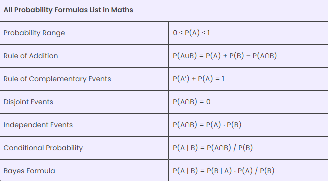
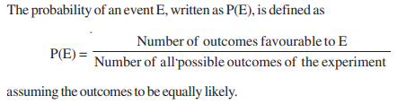
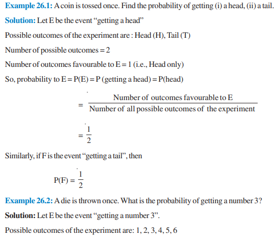
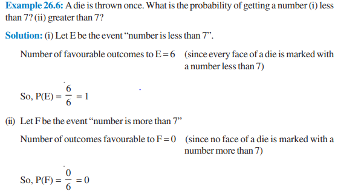

# Probability – Mathematical and Statistical Definition

## Mathematical Definition

- **Definition:**
  - In mathematics, probability refers to the likelihood of a specific event occurring.
  - It is represented by a number between 0 and 1, where 0 indicates impossibility and 1 indicates certainty.

- **Probability of an Event:**
  - For an event A, the probability of A occurring is denoted as P(A).
  - It satisfies the following conditions:
    - 0 ≤ P(A) ≤ 1
    - P(S) = 1, where S is the sample space containing all possible outcomes.

## Statistical Definition

- **Definition:**
  - In statistics, probability measures the relative frequency of occurrence of an event in a long series of trials or experiments.
  - It involves analyzing data to make predictions or draw conclusions about uncertain events.

- **Sample Space and Events:**
  - In statistics, the sample space represents all possible outcomes of an experiment.
  - Events are subsets of the sample space, representing specific outcomes or combinations of outcomes.

- **Empirical Probability:**
  - Empirical probability is based on observed data and is calculated by dividing the number of favorable outcomes by the total number of outcomes.

- **Theoretical Probability:**
  - Theoretical probability is based on mathematical calculations and assumes all outcomes are equally likely.

## Relationship with R

- **Probability Distributions:**
  - R provides functions to work with various probability distributions, such as normal, binomial, and Poisson distributions.
  - These distributions are fundamental in statistical analysis and hypothesis testing.

- **Simulation:**
  - R allows for the simulation of random variables and experiments, enabling the study of probability in practical scenarios.

## Basic Probability Formulas

Let A and B are two events. The probability formulas are listed below:

[Probabilty Formulas](https://byjus.com/probability-formulas/)

## Details 

**Probability**

Probability is a branch of mathematics that deals with the likelihood of random events. It is a measure of the chance that an event will occur, and its value ranges from 0 to 1, where 0 indicates an impossible event and 1 signifies a certain event. The probability of an event is calculated by dividing the number of favorable outcomes by the total number of outcomes.

In statistics, probability is used to make inferences about a population based on a sample. Inferential statistics use probability to estimate the likelihood of a hypothesis being true, given the observed data. Descriptive statistics, on the other hand, are used to summarize and describe data, and do not involve probability.

There are different types of probability, including theoretical probability, experimental probability, and axiomatic probability. Theoretical probability is based on the possible chances of something happening, and is calculated using reasoning and mathematical formulas. Experimental probability is based on the results of actual experiments, and is calculated by dividing the number of successful trials by the total number of trials. Axiomatic probability is based on a set of rules or axioms, such as Kolmogorov's three axioms, which provide a framework for calculating and interpreting probability.

Probability has many applications in real life, including weather forecasting, sports predictions, and financial risk analysis. It is also used in statistics to make inferences about populations based on samples, and to test hypotheses about the relationships between variables.

In summary, probability is a measure of the likelihood of a random event, and is an important concept in both mathematics and statistics. It is used to make predictions, estimate the likelihood of hypotheses being true, and summarize and describe data. There are different types of probability, including theoretical, experimental, and axiomatic probability, and it has many real-world applications.

**Probability of an Event**

The probability of an event is a measure of the likelihood of that event occurring. It is calculated as the ratio of the number of favorable outcomes to the total number of possible outcomes. In probability theory, an event is a set of outcomes of an experiment to which a probability is assigned.

For example, if you roll a six-sided die, the probability of rolling a 6 is 1/6, because there is one favorable outcome (rolling a 6) out of a total of six possible outcomes (rolling a 1, 2, 3, 4, 5, or 6).

In more complex scenarios, the probability of an event may depend on other events. For example, if you draw two cards from a deck of 52 playing cards, the probability of drawing a face card (jack, queen, or king) on the second draw depends on whether or not you drew a face card on the first draw. These types of events are called dependent events.

When calculating the probability of an event, it is important to consider the sample space, which is the set of all possible outcomes of the experiment. For example, if you flip a coin, the sample space is [heads, tails]. If you roll a die, the sample space is [1, 2, 3, 4, 5, 6]. The probability of an event is then calculated as the ratio of the number of favorable outcomes (outcomes that are in the event) to the total number of possible outcomes (the size of the sample space).

In summary, the probability of an event is a measure of the likelihood of that event occurring, calculated as the ratio of the number of favorable outcomes to the total number of possible outcomes. It is an important concept in probability theory and statistics, and is used in a wide variety of applications, from weather forecasting to financial risk analysis.

**Sample Space and Events**

A sample space is the set of all possible outcomes of a statistical experiment. An event is a subset of the sample space, representing a specific outcome or a group of outcomes that we are interested in. For example, when rolling a six-sided die, the sample space is [1, 2, 3, 4, 5, 6], and an event could be "rolling an even number" (E = [2, 4, 6]). The probability of an event is calculated as the number of favorable outcomes (outcomes in the event) divided by the total number of possible outcomes (the size of the sample space). Probability is a measure of the likelihood of an event occurring and is a number between 0 and 1, where 0 indicates an impossible event and 1 signifies a certain event. The concept of sample space and events is fundamental in probability theory and statistics, as it allows us to make predictions and inferences based on the likelihood of different outcomes.

## Numericals on Theory of Probability 

In our day to day life, we sometimes make the statements:
(i) It may rain today
(ii) Train is likely to be late
(iii) It is unlikely that bank made a mistake
(iv) Chances are high that the prices of pulses will go down in next september
(v) I doubt that he will win the race. and so on.
The words may, likely, unlikely, chances, doubt etc. show that the event, we are talking about , is not certain to occur. It may or may not occur. Theory of probability is a branch of mathematics which has been developed to deal with situations involving uncertainty. The theory had its beginning in the 16th century. It originated in the games of chance such as throwing of dice and now probability is used extensively in biology, economics, genetics, physics, sociology etc.

Probability Formula: If an event E occurs, then the empirical probability of an event to happen is:

P(E) = Number of trials in which Event happened/Total number of trials

The theoretical probability of an event E, P(E), is defined as:

P(E) = (Number of outcomes favourable to E)/(Number of all possible outcomes of the experiment)

**Impossible event:** The probability of an occurrence/event impossible to happen is 0. Such an event is called an impossible event.

**Sure event:** The probability of an event that is sure to occur is 1. Such an event is known as a sure event or a certain event.

--------------------------------------------------------------------------------------------------------------------

--------------------------------------------------------------------------------------------------------------------

### More Numericals on Probability

[Probability Questions](https://byjus.com/maths/probability-questions/)
