# Addition and Multiplication Theorem

## Addition Theorem

- **Definition:**
  - The addition theorem, also known as the sum rule, states that the probability of the union of two or more mutually exclusive events is the sum of their individual probabilities.

- **Mathematical Formulation:**
  - P(A or B) = P(A) + P(B) - P(A and B)

- **Mutually Exclusive Events:**
  - Mutually exclusive events are events that cannot occur simultaneously.
  - If events A and B are mutually exclusive, then P(A and B) = 0.

## Multiplication Theorem

- **Definition:**
  - The multiplication theorem, also known as the product rule, states that the probability of the intersection of two events is the product of their individual probabilities given that the first event has occurred.

- **Mathematical Formulation:**
  - P(A and B) = P(A) * P(B|A)

- **Conditional Probability:**
  - P(B|A) represents the probability of event B occurring given that event A has already occurred.

## Relationship with R

- **Calculation:**
  - R provides functions and packages for calculating probabilities, including conditional probabilities, based on data and statistical models.

- **Applications:**
  - Addition and multiplication theorems are fundamental in probability theory and are extensively used in various statistical analyses and modeling techniques implemented in R.

## Conclusion

The addition and multiplication theorems are essential concepts in probability theory, providing rules for calculating the probabilities of combined events and conditional probabilities. In statistical methods using R, these theorems find applications in data analysis, hypothesis testing, and predictive modeling, enabling researchers and analysts to make informed decisions and draw meaningful insights from data. R offers powerful tools and functions for implementing these theorems in practical scenarios, facilitating the application of probability concepts in statistical methods and data science.

## Details 

**The Law of Addition**

The Law of Addition in Probability is used to calculate the probability of at least one of two events occurring. There are two formulas for the Law of Addition in Probability: one for mutually exclusive events and one for non-mutually exclusive events.

For mutually exclusive events, the probability of either event A or event B occurring is the sum of the probabilities of each event:

P(A or B) = P(A) + P(B)

Mutually exclusive events are events that cannot both occur at the same time. For example, rolling a 3 or rolling a 6 on a six-sided die are mutually exclusive events, as it is impossible to roll both a 3 and a 6 on a single roll.

For non-mutually exclusive events, the probability of either event A or event B occurring is the sum of the probabilities of each event minus the probability of both events occurring:

P(A or B) = P(A) + P(B) - P(A and B)

Non-mutually exclusive events are events that can both occur at the same time. For example, drawing a queen or drawing a heart from a deck of cards are non-mutually exclusive events, as it is possible to draw the queen of hearts, which is both a queen and a heart.

The Law of Addition in Probability is used in a variety of applications, including calculating the probability of at least one of multiple criteria being true, the probability of rolling a certain number on a die, the probability of drawing a certain card from a deck, and the probability of a student selected playing at least one of multiple sports.

**Multiplication Theorem**

The Multiplication Theorem of probability is a fundamental concept in probability theory used to calculate the probability of two or more independent events occurring simultaneously. According to the theorem, if A and B are two independent events, then the probability of both events happening at the same time (denoted as P(A ∩ B)) is the product of their individual probabilities (P(A) * P(B)). For dependent events, the multiplication theorem is modified as P(A ∩ B) = P(A) * P(B|A), where P(B|A) is the conditional probability of event B given that event A has already occurred. The Multiplication Theorem of probability is used in various applications, including calculating the probability of multiple independent events occurring simultaneously, and the probability of dependent events occurring in sequence. It is a fundamental concept in probability theory and is used in various fields, including statistics, mathematics, engineering, and data science.

**Multiplication Law of Probability**

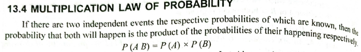

Examples:

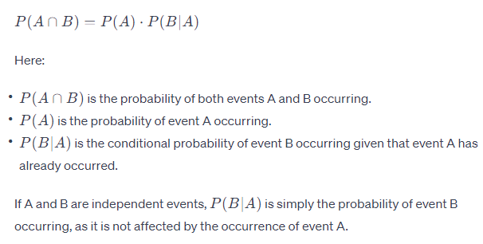
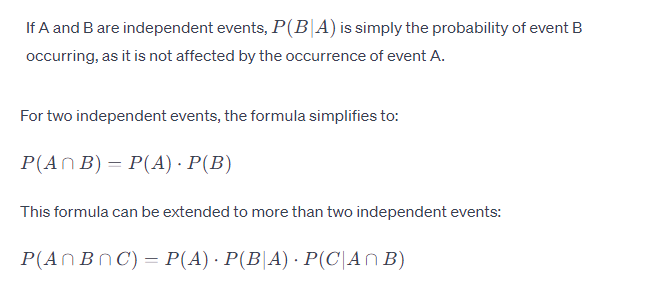

## Numericals

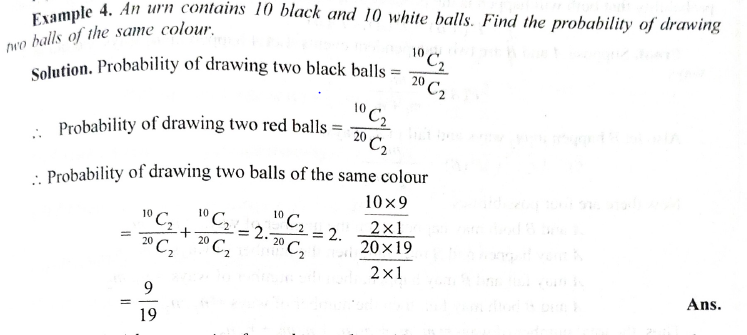

-------------------------------------------------

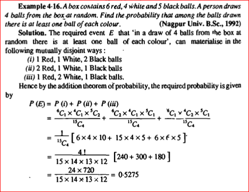

-------------------------------------------------

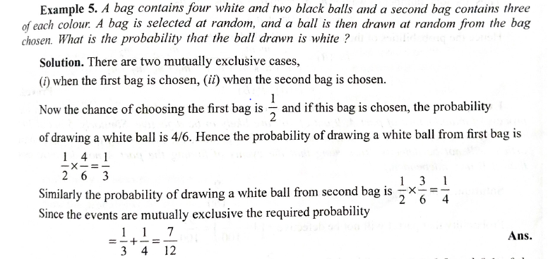

-------------------------------------------------

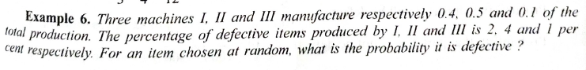
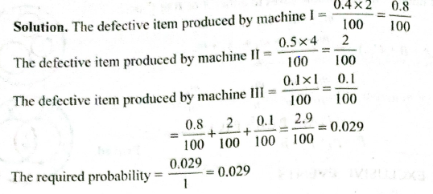

-------------------------------------------------

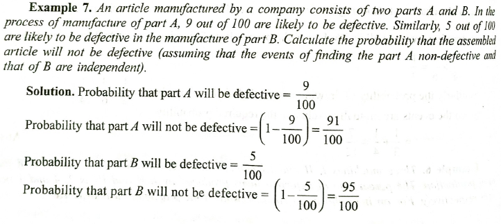
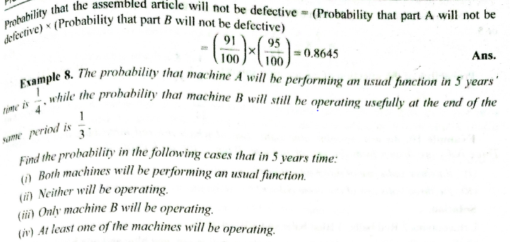
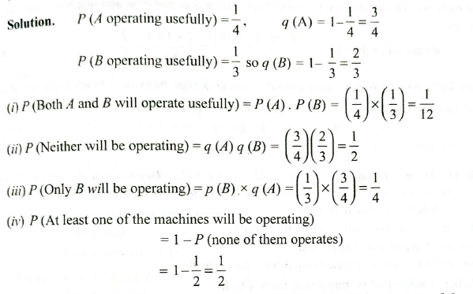

-------------------------------------------------

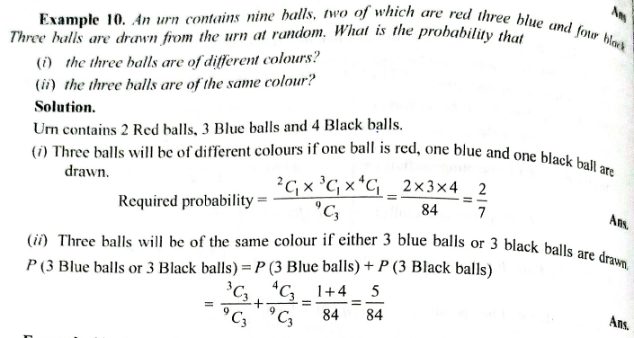