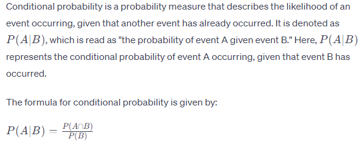
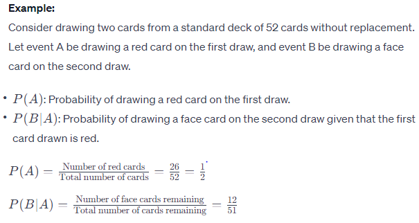
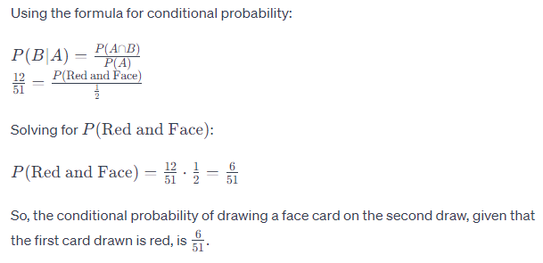

# Conditional Probability

## Definition

- **Definition:**
  - Conditional probability measures the likelihood of an event occurring given that another event has already occurred.
  - It represents the probability of event B happening given that event A has occurred and is denoted as P(B|A).

## Calculation

- **Formula:**
  - The formula for conditional probability is:
    - P(B|A) = P(A and B) / P(A)

- **Interpretation:**
  - P(B|A) is the probability of event B occurring given that event A has already occurred.
  - P(A and B) is the joint probability of both events A and B occurring together.
  - P(A) is the probability of event A occurring.

## Application in R

- **Calculation:**
  - R provides functions and packages for calculating conditional probabilities based on datasets and statistical models.
  - Functions like `prop.table()` or packages like `dplyr` can be used to compute conditional probabilities in R.

## Importance

- **Decision Making:**
  - Conditional probability helps in making decisions based on available information or evidence.
  - It enables predictions and assessments of future events given the occurrence of certain conditions.

- **Risk Assessment:**
  - Conditional probability is used in risk assessment and management to evaluate the likelihood of specific outcomes under different scenarios.

## Example

```r
# Sample dataset
# Consider two events: A and B
# A represents the occurrence of a rainy day
# B represents the occurrence of a traffic jam

# Joint probability of both events occurring together
P_A_and_B <- 0.3

# Probability of event A (rainy day)
P_A <- 0.5

# Calculate conditional probability: P(B|A)
P_B_given_A <- P_A_and_B / P_A
print(P_B_given_A)
```

In this example, if the probability of a rainy day (event A) is 0.5 and the joint probability of both a rainy day and a traffic jam (events A and B) is 0.3, then the conditional probability of a traffic jam given a rainy day (P(B|A)) is calculated to be 0.6.

## Details 

**Conditional Probability**

Conditional probability is the probability of an event occurring given that another event has already occurred. It is denoted as P(A|B), which represents the probability of event A occurring given that event B has occurred. The formula for conditional probability is given by:

P(A|B) = P(A ∩ B) / P(B)

This formula is derived from the general multiplication principle and a little bit of algebra. It is based on the fact that if event B has already occurred, the sample space is reduced to the sample space of A. Therefore, the probability of A and B is the number of elements in A and B divided by the number of elements in A.

For example, suppose that in a certain city, 23% of the days are rainy. If it is known that it is cloudy on a particular day, the probability that it rains on that day can be calculated using conditional probability. Let R be the event that it rains on the randomly chosen day, and C be the event that it is cloudy on the chosen day. Then, the probability of it raining given that it is cloudy, P(R|C), can be calculated as:

P(R|C) = P(R ∩ C) / P(C)

This formula can be used to calculate the probability of any event occurring given that another event has already occurred. It is a fundamental concept in probability theory and is used in various applications, including Bayes' theorem and the multiplication rule.

## Numericals on Conditional Probability





### More Numericals on Conditional Probability

[Conditional Probability Formula](https://byjus.com/conditional-probability-formula/)

[Conditional Probability Questions](https://byjus.com/maths/conditional-probability-questions/)
