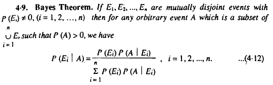
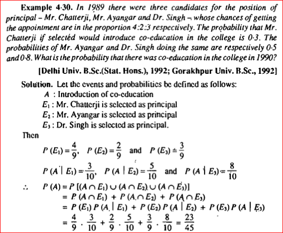
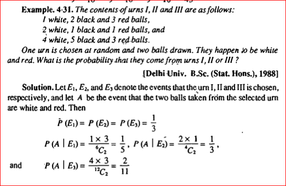
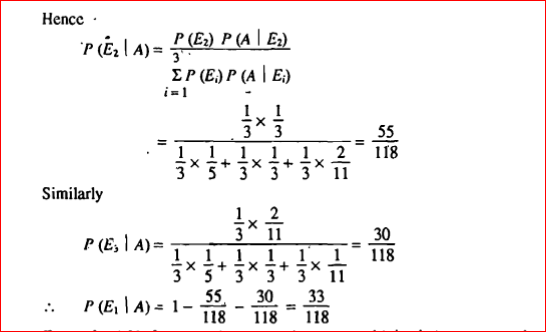
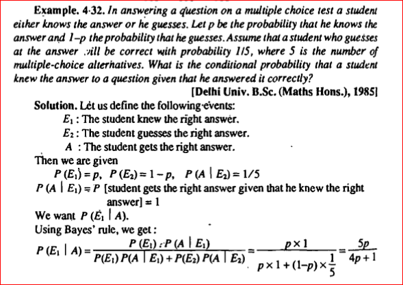
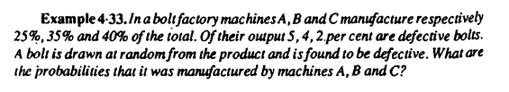
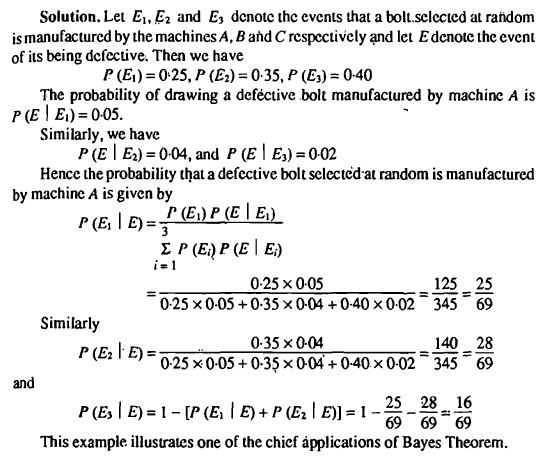

# Bayes Theorem

## Definition

- **Definition:**
  - Bayes theorem is a fundamental principle in probability theory that describes the probability of an event based on prior knowledge or information.
  - It enables the updating of beliefs or probabilities as new evidence becomes available.

- **Formula:**
  - Bayes theorem is mathematically represented as:
    - P(A|B) = (P(B|A) * P(A)) / P(B)

## Components

- **Prior Probability (P(A)):**
  - P(A) represents the initial probability or belief in event A before considering any new evidence.

- **Likelihood (P(B|A)):**
  - P(B|A) is the probability of observing evidence B given that event A has occurred.

- **Evidence (P(B)):**
  - P(B) is the probability of observing evidence B, irrespective of whether event A has occurred or not.

## Application in R

- **Statistical Inference:**
  - Bayes theorem is extensively used in statistical inference, hypothesis testing, and Bayesian modeling.
  - R provides various packages like `bayesplot` and `rstan` for Bayesian analysis and probabilistic modeling.

- **Prediction:**
  - Bayes theorem is employed in predictive modeling to update probabilities and make predictions based on observed data.

## Importance

- **Decision Making:**
  - Bayes theorem facilitates rational decision-making by incorporating new evidence or information into existing beliefs or probabilities.

- **Uncertainty Quantification:**
  - It allows for the quantification of uncertainty and risk in decision-making processes.

## Example

```r
# Sample dataset
# Consider two events: A and B
# A represents the occurrence of a disease
# B represents the presence of symptoms

# Prior probability of disease (P(A))
P_A <- 0.01

# Likelihood of observing symptoms given disease (P(B|A))
P_B_given_A <- 0.95

# Probability of observing symptoms (P(B))
# Assume 10% of the population has symptoms
P_B <- 0.10

# Calculate posterior probability of disease given symptoms (P(A|B))
P_A_given_B <- (P_B_given_A * P_A) / P_B
print(P_A_given_B)
```

In this example, if the prior probability of a disease is 0.01, the likelihood of observing symptoms given the disease is 0.95, and the probability of observing symptoms in the population is 0.10, then the posterior probability of the disease given the presence of symptoms (P(A|B)) is calculated using Bayes theorem.

## Details 

Bayes' theorem is a fundamental concept in probability theory and statistics that describes the probability of an event based on prior knowledge of conditions that might be related to the event. It is named after Thomas Bayes, an 18th-century British statistician. The theorem is expressed mathematically as the equation P(A|B) = [P(B|A) \* P(A)] / P(B), where A and B are events and P(B) ≠ 0. The conditional probability P(A|B) is the probability of event A occurring given that event B is true, also known as the posterior probability. The conditional probability P(B|A) is the probability of event B occurring given that event A is true, also known as the likelihood. The probability P(A) is the prior probability of observing A, and P(B) is the marginal probability of observing B.

Bayes' theorem is used in various applications, including Bayesian inference, a particular approach to statistical inference. When applied, the probabilities involved in the theorem may have different probability interpretations. With Bayesian probability interpretation, the theorem expresses how a degree of belief, expressed as a probability, should rationally change to account for the availability of related evidence. Bayesian inference is fundamental to Bayesian statistics.

The theorem is expressed in the following formula:

P(A|B) = [P(B|A) \* P(A)] / P(B)

Where:

* P(A|B) is the conditional probability of event A occurring given that event B is true.
* P(B|A) is the conditional probability of event B occurring given that event A is true.
* P(A) is the prior probability of observing A.
* P(B) is the marginal probability of observing B.

A special case of the Bayes' theorem is when event A is a binary variable. In such a case, the theorem is expressed in the following way:

P(A+|B) = [P(B|A+) \* P(A+)] / [P(B|A+) \* P(A+) + P(B|A-) \* P(A-)]

Where:

* P(A+|B) is the conditional probability of event A+ occurring given that event B is true.
* P(B|A+) is the conditional probability of event B occurring given that event A+ is true.
* P(A+) is the prior probability of observing A+.
* P(B|A-) is the conditional probability of event B occurring given that event A- is true.
* P(A-) is the prior probability of observing A-.

Bayes' theorem is used in various disciplines, including medicine, pharmacology, finance, and machine learning. In finance, the theorem is used to model the risk of lending money to borrowers or forecast the probability of the success of an investment. In machine learning, the theorem is used in Bayesian networks, which are probabilistic graphical models that represent a set of variables and their conditional dependencies.

In summary, Bayes' theorem is a fundamental concept in probability theory and statistics that describes the probability of an event based on prior knowledge of conditions that might be related to the event. It is used in various applications, including Bayesian inference, finance, and machine learning. The theorem is expressed mathematically as the equation P(A|B) = [P(B|A) \* P(A)] / P(B), where A and B are events and P(B) ≠ 0. The conditional probability P(A|B) is the probability of event A occurring given that event B is true, also known as the posterior probability. The conditional probability P(B|A) is the probability of event B occurring given that event A is true, also known as the likelihood. The probability P(A) is the prior probability of observing A, and P(B) is the marginal probability of observing B.

## Numericals on Bayes Theorem















### More Numericals on Bayes Theorem

[Bayes Theorem Formula](https://byjus.com/bayes-theorem-formula/)

[Bayes Theorem Questions](https://byjus.com/maths/bayes-theorem-questions/)
