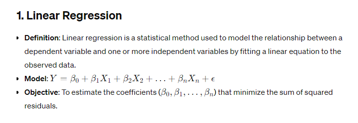
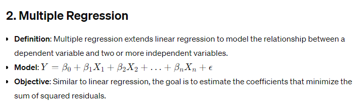
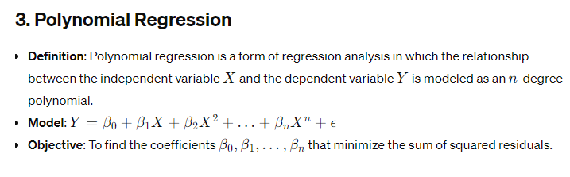
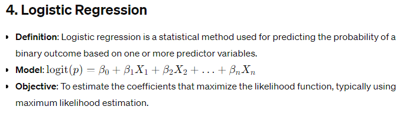
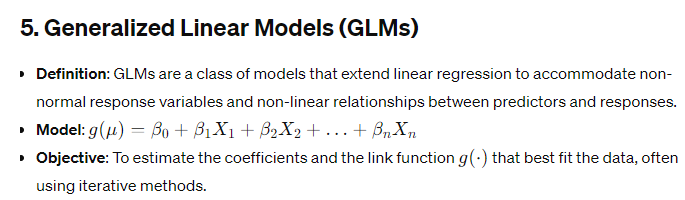

# Various Methods to Perform Regression Analysis

These methods are commonly used in regression analysis to model the relationship between variables and make predictions or inference about the data. Each method has its own assumptions, strengths, and limitations, which should be considered when choosing an appropriate model for analysis.