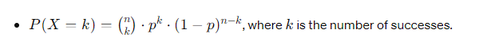

# Binomial Distribution

## Definition
- The Binomial distribution is a discrete probability distribution of the number of successes in a fixed number of independent Bernoulli trials.

## Notation
- X∼Binomial(n,p), where n is the number of trials and p is the probability of success in each trial.

## Parameters
- $$n$$: Number of trials
- $$p$$: Probability of success in each trial

## Probability Mass Function (PMF)

## Mean and Variance
- Mean $$(μ)$$ = $$(np)$$
- Variance $$(σ^2)$$ = $$np(1-p)$$

## Applications
- Modeling the number of successes in repeated independent trials.
- Used in quality control, reliability analysis, and hypothesis testing.

## Example
- Counting the number of heads in 10 coin flips.

## R Functions
- `rbinom()`: Generates random samples from a Binomial distribution.
- `pbinom()`: Calculates cumulative probabilities.
- `qbinom()`: Calculates quantiles.
- `dbinom()`: Evaluates the probability mass function.

## Properties
- Discrete distribution: Deals with integer values only.
- Sum of independent Bernoulli trials.
- Can be approximated by the Normal distribution under certain conditions (Central Limit Theorem).

## Limitations
- Assumes independence between trials.
- Suitable only for experiments with fixed number of trials and constant probability of success.
