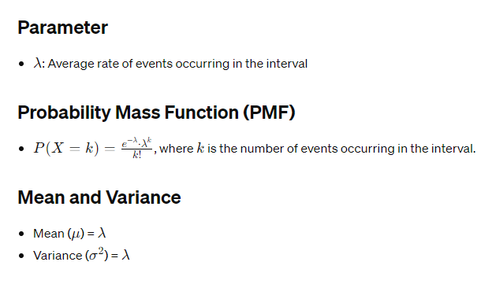

# Poisson Distribution

## Definition
- The Poisson distribution is a discrete probability distribution that represents the number of events occurring in a fixed interval of time or space when the events happen with a known average rate and independently of the time since the last event.

## Notation
- X∼Poisson(λ), where 𝜆 is the average rate of events occurring in the interval.

## Applications
- Modeling rare events such as accidents, arrivals, or occurrences of diseases.
- Used in fields like insurance, telecommunications, and queueing theory.

## Example
- Counting the number of cars passing through a toll booth in a given time period.

## R Functions
- `rpois()`: Generates random samples from a Poisson distribution.
- `ppois()`: Calculates cumulative probabilities.
- `qpois()`: Calculates quantiles.
- `dpois()`: Evaluates the probability mass function.

## Properties
- Discrete distribution: Deals with integer values only.
- Events are independent of each other.
- The number of events can range from 0 to infinity.

## Limitations
- Assumes events occur at a constant rate and independently of each other.
- Not suitable for modeling events with a changing rate over time.

