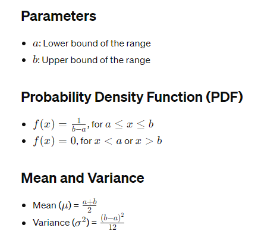

# Uniform Distribution

## Definition
- The Uniform distribution is a continuous probability distribution where every value within a certain range is equally likely to occur.

## Notation
- X∼Uniform(a,b), where 𝑎 and 𝑏 are the parameters defining the range of possible values.

## Applications
- Modeling scenarios where each outcome in a range is equally likely, like rolling a fair die or selecting a random point within a given interval.

## Example
- Generating random numbers between 0 and 1 with equal probability.

## R Functions
- `runif()`: Generates random samples from a Uniform distribution.
- `punif()`: Calculates cumulative probabilities.
- `qunif()`: Calculates quantiles.
- `dunif()`: Evaluates the probability density function.

## Properties
- Continuous distribution: Deals with an infinite number of possible values.
- Constant probability density within the specified range.

## Limitations
- Assumes all values within the range are equally likely.
- May not be suitable for scenarios where probabilities are not uniform across the range.
