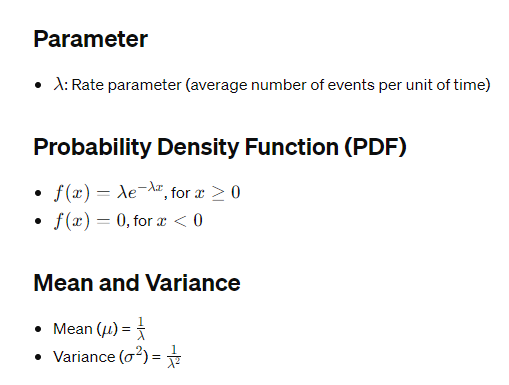

# Exponential Distribution

## Definition
- The Exponential distribution is a continuous probability distribution that describes the time between events in a Poisson process, where events occur continuously and independently at a constant average rate.

## Notation
- X∼Exponential(λ), where 𝜆 is the rate parameter.

## Applications
- Modeling waiting times between events such as arrival times in a queue, the lifespan of certain products, or time between phone calls.

## Example
- Time until the next customer arrives at a store, given an average arrival rate.

## R Functions
- `rexp()`: Generates random samples from an Exponential distribution.
- `pexp()`: Calculates cumulative probabilities.
- `qexp()`: Calculates quantiles.
- `dexp()`: Evaluates the probability density function.

## Properties
- Continuous distribution: Deals with an infinite number of possible values.
- Memoryless property: Future waiting time is independent of past waiting time given the current waiting time.

## Limitations
- Assumes events occur at a constant average rate.
- May not accurately model situations where the rate of events changes over time.

