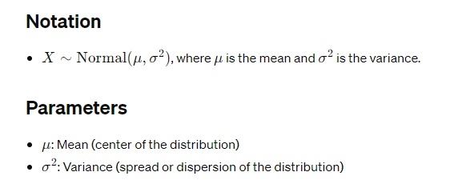
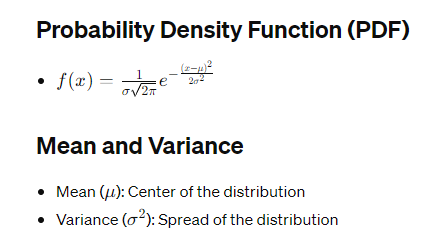

# Normal Distribution

## Definition
- The Normal distribution, also known as the Gaussian distribution, is a continuous probability distribution that is symmetric around the mean, with the majority of the values falling close to the mean.

## Applications
- Modeling naturally occurring phenomena such as heights, weights, test scores, and errors.

## Example
- Heights of individuals in a population.

## R Functions
- `rnorm()`: Generates random samples from a Normal distribution.
- `pnorm()`: Calculates cumulative probabilities.
- `qnorm()`: Calculates quantiles.
- `dnorm()`: Evaluates the probability density function.

## Properties
- Continuous distribution: Deals with an infinite number of possible values.
- Symmetric bell-shaped curve.
- Mean, median, and mode are equal.

## Limitations
- Assumes data is normally distributed, which may not always be the case.
- Sensitive to outliers.

## Properties of Normal Distribution

Sure, here are some key properties of the Normal distribution:

1. **Symmetry**: The Normal distribution is symmetric around its mean. This means that the probability of a value occurring to the left of the mean is equal to the probability of the same value occurring to the right of the mean.

2. **Bell-shaped curve**: The graph of the Normal distribution forms a bell-shaped curve, with the highest point at the mean. As you move away from the mean in either direction, the probability density decreases gradually.

3. **Mean, Median, and Mode**: In a Normal distribution, the mean, median, and mode are all equal. They are located at the center of the distribution.

4. **Standard Deviation**: The spread or dispersion of the distribution is determined by the standard deviation $$(𝜎)$$. The larger the standard deviation, the wider the distribution, and vice versa.

5. **Empirical Rule**: The Normal distribution follows the empirical rule, also known as the 68-95-99.7 rule. Approximately 68% of the data falls within one standard deviation of the mean, 95% within two standard deviations, and 99.7% within three standard deviations.

6. **Central Limit Theorem**: According to the Central Limit Theorem, the sum (or average) of a large number of independent, identically distributed random variables tends towards a Normal distribution, regardless of the original distribution of the variables.

7. **Additivity and Multiplicativity**: If two independent random variables are normally distributed, their sum (or linear combination) is also normally distributed. Similarly, if a random variable is multiplied by a constant, the resulting variable is still normally distributed.

8. **Characterized by Mean and Variance**: The Normal distribution is fully characterized by its mean $$(𝜇)$$ and variance $$(σ^2)$$. Once these parameters are known, the entire distribution is determined.

